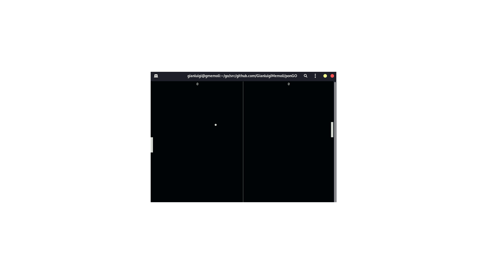

# ponGO - A CLI pong remake in Golang with a very silly AI player
### This was possible thaks to the tcell library

The initial idea was to make an udp based pong game but for now is shelved

### A view

### To run after compiling just:
### `./ponGO` in the terminal